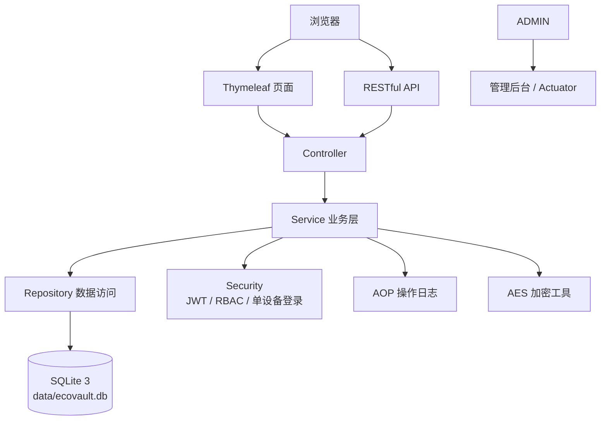

# EcoVault（生态保险箱）


EcoVault（生态保险箱）是一个个人数据安全存储与管理平台，面向个人、家庭与小团队私有化部署场景，提供密码、财务、日志与后台管理能力。项目强调安全存储、权限隔离、可审计、易部署与现代化用户体验。



## 项目简介

EcoVault 使用 Java 25 与 Spring Boot 4.0.x 构建，主类为 `com.tlcsdm.ecovault.EcoVaultApplication`，Jar artifact id 为 `ecovault`。系统默认使用嵌入式 SQLite 数据库文件 `data/ecovault.db`，前端以 Thymeleaf 服务端渲染为主，可按需增强 Vue 3 交互。

## 功能特性

### 用户管理

- RBAC 权限模型，内置 `USER` 与 `ADMIN`。
- JWT 登录认证，支持 `ecovault.security.max-devices` 配置登录设备数。
- BCrypt 密码哈希，禁止保存明文登录密码。
- 用户启用、禁用、角色分配与会话失效。

### 密码管理

- 密码条目新增、编辑、删除、分页与搜索。
- 标签分类、密码强度检测与安全提示。
- 敏感密码内容使用 AES 加密存储。

### 财务管理

- 工资数据录入、编辑、删除与查询。
- 月度、年度统计分析与图表展示。
- CSV 导出，预留消费数据扩展能力。

### 日志管理

- AOP 自动记录关键操作。
- 支持按用户、模块、动作、时间筛选和搜索。
- 支持日志导出与敏感字段脱敏。

### 管理后台

- 用户列表、启用禁用、角色管理。
- 系统状态、构建版本、构建信息查看。
- Actuator 端点限制 `ADMIN` 访问。

## 技术栈

| 分类 | 技术 |
| --- | --- |
| 语言 | Java 25 |
| 框架 | Spring Boot 4.0.x、Spring Security、Spring MVC |
| 数据库 | SQLite 3（嵌入式，`data/ecovault.db`） |
| 前端 | Thymeleaf、可选 Vue 3、Chart.js / ECharts |
| UI | Tailwind-style、玻璃拟态、渐变、暗色/亮色主题 |
| 安全 | JWT、BCrypt、AES、CSRF、XSS、SQL 注入防护 |
| 构建测试 | Maven、JUnit 5、JaCoCo |
| 部署 | Docker、Jenkins、deploy.sh、Actuator |

## 项目结构

```text
EcoVault/
├── .github/
│   ├── ISSUE_TEMPLATE/
│   ├── CODEOWNERS
│   ├── PULL_REQUEST_TEMPLATE.md
│   └── copilot-instructions.md
├── deploy/
│   └── deploy.sh
├── docs/
│   ├── 设计文档.md
│   └── 开发规范.md
├── src/
│   └── main/java/com/tlcsdm/ecovault/...
├── Dockerfile
├── Jenkinsfile
├── LICENSE
├── README.md
└── CONTRIBUTING.md
```

## 快速开始

### 环境要求

- Java 25
- Maven 3.9+
- SQLite 3（嵌入式使用，通常无需单独启动）

### 构建

```bash
mvn clean package
```

### 运行

```bash
java -jar target/ecovault.jar
```

### 访问

```text
http://localhost:8080
```

## 配置说明

关键配置由 `application.yml` 提供，建议包含：

```yaml
ecovault:
  security:
    jwt-secret: "请替换为生产环境强随机密钥"
    max-devices: 1
  sqlite:
    path: "data/ecovault.db"

management:
  endpoints:
    web:
      exposure:
        include: health,info
  endpoint:
    health:
      show-details: when_authorized
```

- `ecovault.security.jwt-secret`：JWT 签名密钥，生产环境必须使用强随机值。
- `ecovault.security.max-devices`：单用户允许同时登录设备数，默认建议为 `1`。
- `ecovault.sqlite.path`：SQLite 数据库路径。
- `management.*`：Actuator 暴露策略，详细信息必须限制 `ADMIN` 访问。

## 测试与覆盖率

```bash
mvn test
```

JaCoCo 报告位置：

```text
target/site/jacoco/index.html
```

## 部署

### Docker

```bash
docker build -t ecovault:latest .
docker run -d --name ecovault -p 8080:8080 -v $(pwd)/data:/app/data ecovault:latest
```

### Jenkins

`Jenkinsfile` 包含检出、构建、测试、JaCoCo、归档与主分支部署阶段。

### deploy.sh

```bash
bash deploy/deploy.sh
```

脚本会停止旧服务、备份旧 Jar、部署 `target/ecovault.jar`，以 `prod` 配置启动并执行健康检查。

## Actuator / 构建信息

- `/actuator/health`：健康检查。
- `/actuator/info`：构建版本、构建时间等信息。
- ADMIN 等同开发者角色，可通过 Actuator 与自定义后台页面查看构建信息。
- 除健康检查必要场景外，Actuator 信息必须限制为 `ADMIN`。

## 安全说明

- JWT 用于认证，结合服务端会话记录实现单设备登录。
- BCrypt 用于登录密码哈希。
- AES 用于加密密码条目敏感字段。
- 页面表单启用 CSRF 防护，输出内容进行 HTML 转义防止 XSS。
- 数据访问必须使用参数绑定或 ORM 参数化能力，防止 SQL 注入。
- 日志中禁止输出密钥、Token、明文密码、数据库文件内容等敏感信息。

## 贡献指南

请阅读 [CONTRIBUTING.md](CONTRIBUTING.md) 与 [docs/开发规范.md](docs/开发规范.md)。每次变更都应同步更新文档并补充必要测试。

## 开源协议

本项目基于 MIT 协议开源。版权所有 © 梦里不知身是客（2026）。
