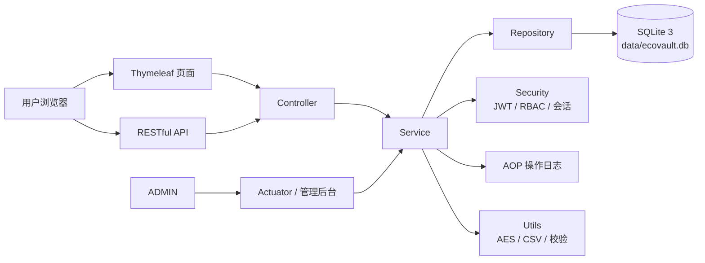
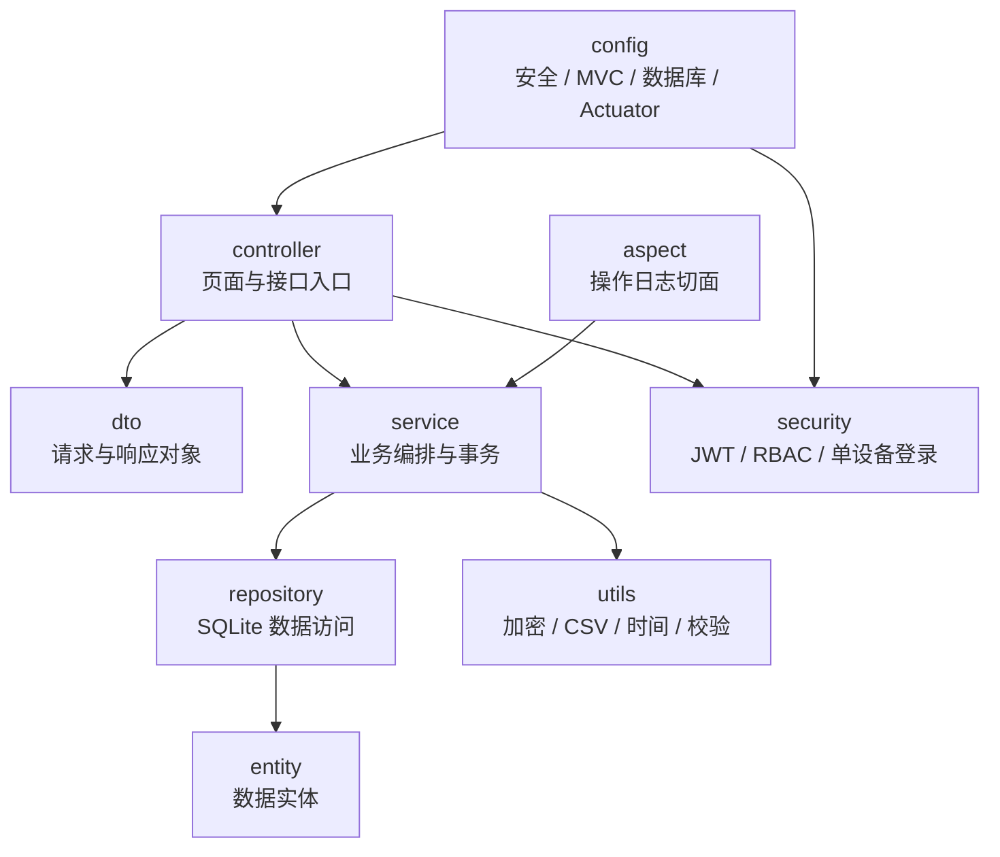
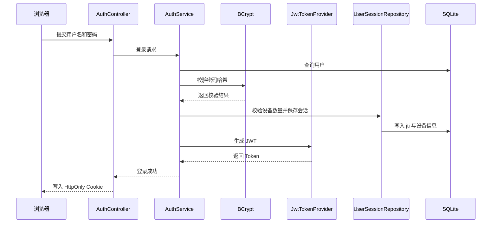
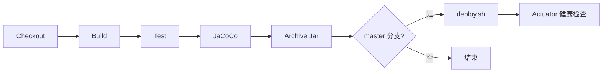

# EcoVault 设计文档

> 每次代码变更都需同步更新本文档。

## 1. 项目概述与目标

EcoVault（生态保险箱）是一个个人数据安全存储与管理平台，目标是为用户提供密码管理、工资财务管理、操作日志审计与管理后台能力。系统以安全、可审计、易维护、易部署为核心原则，支持个人私有化部署和小团队内部使用。

目标：

- 以加密和权限隔离保护个人敏感数据。
- 通过 RBAC 区分 `USER` 与 `ADMIN` 权限。
- 通过 AOP 自动记录关键操作，形成可追踪审计链路。
- 通过 Jenkins、GitHub Actions 与部署脚本降低运维成本。
- 通过测试覆盖率和开发规范保证长期可维护性。

## 2. 技术架构

### 整体架构

### 分层架构

统一包名前缀为 `com.tlcsdm.ecovault`。

## 3. 功能模块设计

### 用户管理

职责：管理员创建用户、登录、退出、当前用户信息、账号启用禁用、会话管理。

主要类：`AuthController`、`AdminController`、`AuthService`、`AdminService`、`JwtTokenProvider`、`UserSessionRepository`、`UserRepository`。

流程：

1. 管理员在后台用户管理页提交新用户信息，可为其指定角色（`USER`/`ADMIN`），默认 `USER`。
2. 服务端校验用户名唯一性，并使用 BCrypt 处理初始密码。
3. 新用户按所选角色创建并启用；管理员可编辑用户昵称、邮箱、角色、启用状态与重置密码，或删除用户。
4. 用户登录后，系统查询用户、校验 BCrypt 哈希、判断启用状态和角色，根据 `ecovault.security.max-devices` 处理旧会话，生成 JWT 并写入会话记录。

### 密码管理

职责：密码条目增删改查、标签管理、强度检测、搜索、AES 加密存储。

主要类：`PasswordController`、`PasswordService`、`PasswordStrengthUtil`、`AesUtil`、`PasswordEntryRepository`。

流程：用户提交条目，后端校验权限与字段，敏感字段 AES-GCM 加密后保存，AOP 记录操作日志。

### 财务管理

职责：工资数据录入、统计分析、CSV 导出；收入支出记账、按标签/时间多维查询、统计分析与 CSV 导出。

主要类：`SalaryController`、`SalaryService`、`SalaryRecordRepository`；`LedgerController`、`LedgerService`、`LedgerEntryRepository`、`LedgerEntry`、`LedgerType`。

流程：

1. 工资：用户按工资条分类录入工资记录，系统校验年月与金额后保存，按月份、年份汇总并通过 Chart.js 展示。工资条按以下分类录入并派生统计：
   - **发放项**：基本工资、绩效工资、租房补助、伙食补助、交通补贴、加班费、加班补助、奖金；求和得到 **应发工资**。
   - **缴费基数**（仅记录）：医疗保险缴费基数、养老失业缴费基数、公积金缴费基数。
   - **扣除项**：医疗、养老、失业、公积金；求和得到 **扣除项合计**。
   - **税前工资** = 应发工资 − 扣除项合计；**所得税** 录入后 **税后工资** = 税前工资 − 所得税。
   - **税后附加项**：大病医疗、采暖补贴；**实发金额** = 税后工资 + 大病医疗 + 采暖补贴。
   - **年终奖**：每年额外录入，以 `month = 0` 的记录表示（`isAnnualBonus` 为真），在统计中单独汇总为「年终奖合计」，不计入月度趋势与月均实发。
   - **兼容迁移**：应用启动时会检查旧版 `salary_records` 表中遗留的 `allowance` / `deduction` 列；若存在，则自动重建为新版分类结构，将旧 `allowance` 映射到 `housing_allowance`、旧 `deduction` 映射到 `medical_deduction`，避免 SQLite 因旧列 `NOT NULL` 约束导致新增工资或年终奖失败。
   - 统计结果包含实发合计/月均/最高/最低、奖金合计、年终奖合计，以及发放项构成与扣除项构成，供收入构成/扣除构成图表展示。
2. 收入支出：用户记录某天的一笔收入或支出，可为其打上多个标签（`ledger_entry_tags`），系统按类型、时间区间与标签过滤查询，并按标签、按月汇总收入/支出/结余，支持导出 CSV。

### 日志管理

职责：AOP 自动记录操作日志，支持按模块/关键字/时间区间筛选、分页、查看详情（含请求参数）、修改、删除与导出。仅管理员可访问。

主要类：`OperationLogAspect`、`OperationLogService`、`LogController`、`OperationLogRepository`。

流程：业务方法执行前后由切面收集用户、模块、动作、结果、IP 与请求参数，参数以 JSON 序列化并对 `password/pwd/secret/token/credential/privatekey` 等敏感字段脱敏后写入 `operation_logs`。日志管理接口 `/api/logs/**` 与页面 `/admin/logs` 均限定 `ADMIN` 访问，普通用户不可见。

### 管理后台

职责：创建普通用户（可指定角色）、编辑与删除用户、启用禁用账号、角色页面权限管理、系统状态、构建信息与 Actuator 信息查看。

主要类：`AdminController`、`AdminService`、`RolePermissionService`、`RolePermission`、`MenuPage`、`BuildProperties`。

其中角色管理基于 `MenuPage` 枚举维护页面元数据（key、名称、路径、分组、是否仅管理员、是否可配置），管理员可在角色管理页为普通角色分配「可配置页面」（密码管理、工资管理、收入支出管理）的访问权限，权限持久化于 `role_permissions` 表。`ADMIN` 角色固定拥有全部页面访问权，服务端禁止通过 API 修改其配置。后台管理分组页面（用户管理、日志管理、角色管理）固定仅管理员可访问；控制台与个人中心对所有登录用户开放。创建用户时可为其分配角色。

## 4. 数据库设计

### 核心表

| 表 | 关键列 | 说明 | 索引 |
| --- | --- | --- | --- |
| users | id、username、password、role、enabled、created_at、updated_at | 用户基础信息与 BCrypt 哈希密码 | `idx_users_username` |
| user_sessions | id、user_id、jti、device_info、ip、active、created_at | 登录会话与单设备控制 | `idx_user_sessions_user_id`、`idx_user_sessions_jti` |
| password_entries | id、user_id、title、username、secret、note、tags、strength_score、strength_level、created_at、updated_at | 密码条目与敏感字段密文 | `idx_password_entries_user_id`、`idx_password_entries_title` |
| salary_records | id、user_id、year、month(0 表示年终奖)、base_salary、performance_salary、housing_allowance、meal_allowance、transport_allowance、overtime_pay、overtime_allowance、bonus、medical_base、pension_unemployment_base、housing_fund_base、medical_deduction、pension_deduction、unemployment_deduction、housing_fund_deduction、income_tax、serious_illness_medical、heating_allowance、remark、created_at、updated_at | 工资条分类记录与统计来源；应发/扣除合计/税前/税后/实发为派生计算 | 唯一约束 `uk_salary_user_ym(user_id,year,month)`、`idx_salary_user`、`idx_salary_ym(year,month)` |
| ledger_entries | id、user_id、type、amount、entry_date、remark、created_at、updated_at | 收入支出记录 (INCOME/EXPENSE) | `idx_ledger_user`、`idx_ledger_date`、`idx_ledger_type` |
| ledger_entry_tags | entry_id、tag | 收支记录标签集合 (一条记录多标签) | `idx_ledger_tag` |
| operation_logs | id、user_id、username、module、operation、method、params、ip、status、error_msg、duration_ms、created_at | 脱敏后的审计日志 (params 为脱敏后的请求参数) | `idx_operation_logs_user_id`、`idx_operation_logs_created_at` |
| role_permissions | id、role、page_key | 角色-页面权限映射 (RBAC 页面级授权) | 唯一约束 `uk_role_page(role,page_key)` |

### 自增主键与自定义 SQLite 方言

项目使用 `GenerationType.IDENTITY` 依赖 SQLite 的 `INTEGER PRIMARY KEY`（rowid 别名）实现主键自增。Hibernate 7.x 社区版 `SQLiteDialect` 在导出建表语句时存在缺陷：判断是否为自增主键列追加 `integer` 类型串时，比较的是"整张表当前已累积的列定义"而非当前列本身。因此当实体中主键列之前存在其它 `integer` 类型列（如 `salary_records` 的 `year`/`month`、`password_entries` 的 `strength_score`）时，主键列会被误判为"已包含 integer"而漏掉类型声明，生成 `id,`（无类型）的定义，导致主键无法自增、插入后主键为 `NULL`，查询结果被反序列化为 `null`。

为修复该问题，项目提供自定义方言 `com.tlcsdm.ecovault.config.EcoVaultSQLiteDialect`，将身份列类型串改为大写 `INTEGER`。由于缺陷判断在比较前会将缓冲区转为小写，永远不会包含大写串，类型声明得以稳定输出；同时 SQLite 类型名大小写不敏感，`INTEGER PRIMARY KEY` 仍作为 rowid 别名正常自增。`application.yml` 通过 `spring.jpa.properties.hibernate.dialect` 指向该自定义方言。

## 5. 安全设计

### JWT 认证流程

### 单设备登录机制

- 配置项为 `ecovault.security.max-devices`。
- JWT 默认 2 小时后失效，配置项为 `ecovault.security.jwt-expiration-ms`，可按毫秒自定义登录时长。
- 每次登录生成新的 JWT `jti` 并持久化到 `user_sessions`。
- 超过设备限制时将最早的有效会话置为失效。
- 每次请求同时校验 JWT 签名、过期时间和 `jti` 是否仍为有效会话。
- 修改密码、禁用账号或退出登录时立即失效会话。

### RBAC

- `USER`：仅访问自身密码、工资、收入支出数据；可访问的「可配置页面」由管理员在角色管理中分配。
- `ADMIN`：访问用户管理、角色管理、系统状态、构建信息、Actuator 和全局操作日志，可访问全部页面。
- 管理接口必须显式校验 `ADMIN`；操作日志接口 `/api/logs/**` 及页面 `/admin/logs` 仅 `ADMIN` 可见，普通用户不可查看。
- 页面级访问基于 `MenuPage` 枚举与 `role_permissions` 表：后台管理分组页面固定仅管理员可访问；控制台与个人中心对所有登录用户开放；密码管理、工资管理、收入支出管理为可配置页面，按角色授权决定是否可访问（`PageController` 在服务端二次校验 `canAccessPath`，越权访问重定向至控制台）。
- 对外不开放注册接口，用户创建能力只保留在管理员后台，创建时可为用户分配角色。

### BCrypt 与 AES-GCM 设计

#### 登录密码处理

1. 管理员在后台创建用户时提交初始密码。
2. 服务端立即使用 `BCryptPasswordEncoder` 生成不可逆哈希。
3. 数据库仅保存哈希值，不保存盐值外的任何明文副本。
4. 登录时使用 `matches` 做哈希校验，失败统一返回模糊错误信息。

#### 密码条目加密流程

1. 应用从 `ECOVAULT_CRYPTO_SECRET` 读取 AES 主密钥材料。
2. `AesUtil` 将主密钥规范化到 AES 所需长度后创建密钥对象。
3. 每次加密时随机生成新的 IV，并使用 `AES/GCM/NoPadding` 处理敏感字段。
4. 输出内容采用“IV + 密文 + GCM 认证标签”组合并编码保存。
5. 解密时先拆分随机 IV，再校验 GCM 标签，若密文被篡改则直接失败。
6. 明文仅在内存中短暂存在，用于响应组装，不写日志、不写导出缓存、不写数据库。

#### 高敏数据保护要求

- 系统可能存储银行卡密码、支付口令等高度敏感信息，因此必须使用具备完整性校验的对称加密方案。
- 文档、日志、异常与页面均不得泄露密钥、明文、Token 或可逆提示。
- 示例配置只能提供占位符，生产环境应通过环境变量或专用密钥管理方案注入密钥。

### 依赖与供应链治理

- 使用 `.github/dependabot.yml` 每周检查 Maven 依赖与 GitHub Actions 版本更新。
- 依赖升级仍需经过 CI、测试与人工审查后再合并，避免将自动升级直接视为可信变更。

### CSRF / XSS / SQL 注入防护

- 页面写操作通过 `CookieCsrfTokenRepository` + `X-XSRF-TOKEN` 头进行 CSRF 防护。
- 页面输出统一 HTML 转义。
- 数据访问使用 JPA 参数绑定，禁止拼接 SQL。
- CSV 导出防止公式注入。

### 时间与时区规范

- `spring.jackson.time-zone` 统一为 `GMT+8`（北京时间，东八区）。
- JSON 日期时间格式统一为 `yyyy-MM-dd HH:mm:ss`、日期为 `yyyy-MM-dd`，去除 ISO 默认格式中的字母 `T`，便于阅读。
- Spring MVC 参数绑定格式同步配置为 `date=yyyy-MM-dd`、`time=HH:mm:ss`、`date-time=yyyy-MM-dd HH:mm:ss`。
- `DateTimeConfig` 集中定义 `DATE_PATTERN`、`DATE_TIME_PATTERN` 与 `TIME_ZONE` 常量，同步约束 Jackson 与 MVC，并被实体/DTO 上的 `@JsonFormat` 复用，避免 `LocalDate`/`LocalDateTime` 使用默认 ISO 格式（如带 `T` 的 `2026-07-04T13:28:26.357`）。

## 6. API 设计

| 模块 | 方法 | 端点 | 说明 | 权限 |
| --- | --- | --- | --- | --- |
| 用户 | POST | `/api/auth/login` | 用户登录 | 匿名 |
| 用户 | POST | `/api/auth/logout` | 用户退出 | USER |
| 用户 | GET | `/api/auth/me` | 当前用户 | USER |
| 用户 | PUT | `/api/auth/profile` | 修改资料 | USER |
| 用户 | PUT | `/api/auth/password` | 修改密码 | USER |
| 密码 | GET | `/api/passwords` | 查询密码 | USER |
| 密码 | POST | `/api/passwords` | 新增密码 | USER |
| 密码 | PUT | `/api/passwords/{id}` | 更新密码 | USER |
| 密码 | DELETE | `/api/passwords/{id}` | 删除密码 | USER |
| 工资 | GET | `/api/finance/salaries` | 查询工资 | USER |
| 工资 | POST | `/api/finance/salaries` | 新增工资 | USER |
| 工资 | PUT | `/api/finance/salaries/{id}` | 更新工资 | USER |
| 工资 | DELETE | `/api/finance/salaries/{id}` | 删除工资 | USER |
| 工资 | GET | `/api/finance/salaries/statistics` | 工资统计 | USER |
| 工资 | GET | `/api/finance/salaries/export` | CSV 导出 | USER |
| 收支 | GET | `/api/finance/ledger` | 查询收支 (类型/时间区间/标签) | USER |
| 收支 | POST | `/api/finance/ledger` | 新增收支记录 (多标签) | USER |
| 收支 | PUT | `/api/finance/ledger/{id}` | 更新收支记录 | USER |
| 收支 | DELETE | `/api/finance/ledger/{id}` | 删除收支记录 | USER |
| 收支 | GET | `/api/finance/ledger/statistics` | 收支统计 (按标签/按月) | USER |
| 收支 | GET | `/api/finance/ledger/export` | CSV 导出 | USER |
| 日志 | GET | `/api/logs` | 查询日志 (模块/关键字/时间区间) | ADMIN |
| 日志 | GET | `/api/logs/{id}` | 查看日志详情 (含参数) | ADMIN |
| 日志 | PUT | `/api/logs/{id}` | 修改日志模块与操作 | ADMIN |
| 日志 | DELETE | `/api/logs/{id}` | 删除日志 | ADMIN |
| 日志 | GET | `/api/logs/export` | 导出日志 | ADMIN |
| 管理 | POST | `/api/admin/users` | 创建普通用户 (可指定角色) | ADMIN |
| 管理 | GET | `/api/admin/users` | 用户列表 | ADMIN |
| 管理 | PUT | `/api/admin/users/{id}/status` | 启用禁用 | ADMIN |
| 管理 | PUT | `/api/admin/users/{id}` | 编辑用户 (昵称/邮箱/角色/启用/重置密码) | ADMIN |
| 管理 | DELETE | `/api/admin/users/{id}` | 删除用户 | ADMIN |
| 管理 | GET | `/api/admin/roles` | 角色页面权限矩阵 | ADMIN |
| 管理 | PUT | `/api/admin/roles/{role}/permissions` | 更新普通角色页面权限（禁止修改 ADMIN） | ADMIN |
| 管理 | GET | `/api/admin/build-info` | 构建信息 | ADMIN |

## 7. 前端设计

页面：`/`、`/login`、`/dashboard`、`/passwords`、`/finance`（工资管理）、`/finance/ledger`（收入支出管理）、`/profile`、`/admin`（后台首页：构建信息/系统状态）、`/admin/users`（用户管理）、`/admin/logs`（日志管理）、`/admin/roles`（角色管理）、`/error`。

导航采用下拉子菜单：财务管理分组包含工资管理与收入支出管理；后台管理分组（仅管理员可见）点击父菜单进入 `/admin` 后台首页，下拉菜单仅保留用户管理、日志管理与角色管理。前端根据 `/api/auth/me` 返回的 `pages` 可访问页面列表动态渲染菜单项。日志管理筛选区采用一体化时间范围输入，并提供清空搜索条件按钮。

日志分页接口 `/api/logs` 返回自定义稳定分页 DTO（`content`、`number`、`size`、`totalElements`、`totalPages`、`first`、`last`），避免直接暴露 `PageImpl` 序列化结构并消除 Spring Data 的运行时告警。

设计要求：支持暗色/亮色主题切换，采用玻璃拟态卡片、渐变背景、圆角阴影与响应式布局。公共 `head` 片段统一注入 `favicon.ico`，避免浏览器自动请求时报 404，并统一输出 `<meta name="renderer" content="webkit">` 与 `<meta name="google" content="notranslate"/>`。工资趋势、年度统计、收入构成、收支标签/月度趋势与后台状态图表使用 Chart.js。

## 8. 测试策略

- 使用 JUnit 5 编写单元测试和集成测试。
- 使用 JaCoCo 生成覆盖率报告，位置为 `target/site/jacoco/index.html`。
- Security、Service、Controller 核心路径均需覆盖。
- JWT、单设备登录、RBAC、AES、CSV 导出、统计逻辑必须覆盖边界场景。
- 收入支出记账（多标签、按标签/时间过滤、统计、非法日期范围与 CSV 导出）、角色页面权限（矩阵、普通角色更新、ADMIN 禁改、越权判定）、日志管理（详情、时间区间、修改删除、仅管理员可见）与用户编辑删除均需覆盖。
- 外部注册关闭后，需验证管理员创建用户与匿名访问受限行为。

### 覆盖率强化

为持续保障可维护性，测试覆盖率经过专项强化，覆盖以下维度：

- 实体、DTO、通用返回体与全局异常处理的取值与生命周期。
- 工具类（IP 解析、密码强度、AES 加解密）的全部判定分支。
- 安全组件（`SecurityUtils`、`SecurityUser`、`CustomUserDetailsService`、`JwtAuthenticationFilter`、`CsrfCookieFilter`）。
- 操作日志切面的成功/失败路径、参数脱敏与保存失败不影响主流程。
- 用户、密码、财务、日志、管理后台控制器的增删改查、鉴权与导出流程（集成测试基于 `@SpringBootTest` + MockMvc，并注入真实 `SecurityUser` 主体）。
- 服务层针对空值、空白、边界与异常分支的补充断言。
- 针对无法经由常规流程触发的异常路径（如 `AesUtil.encrypt`、`JwtTokenProvider.sha256` 的算法不可用分支、`SpringApplication.run` 启动入口）使用 Mockito `mockStatic` 精确覆盖。

经专项补测后，指令、分支、行、方法与类覆盖率均达到 100%。在补测过程中，对少量恒不可达的防御性分支做了安全化简，以消除永远无法覆盖的判定：

- `PasswordStrengthUtil.evaluate`：移除 `score > 100` 的封顶判断（长度最高 40 分 + 四类字符各 15 分，合计恰为 100，永不越界）。
- `PasswordServiceImpl.list` / `decryptTags`：移除对 `tags()`、解密结果的多余 `null` 前置判断（`decryptTags` 恒返回非空列表，AES 解密非空密文亦恒返回非空串）。
- `AuthServiceImpl.enforceDeviceLimit`：移除循环中冗余的 `&& i < activeSessions.size()` 条件（`toRevoke` 恒不大于活跃会话数）。
- `EcoVaultApplication.ensureDatabaseDirectory`：拆分为读取环境变量的私有方法与接收路径参数的包级重载，便于对「无父目录」「父目录已存在」「父目录待创建」分支做单元测试。

## 9. 部署与运维

### GitHub Actions / Jenkins 流程

- GitHub Actions 的 PR CI 仅在涉及代码、构建配置或运行相关资源时触发；仅修改 `docs/**`、Markdown 文档、`LICENSE`、`.gitignore` 等与构建无关的资源时跳过，避免无效构建。

### 启动参数约束

- `banner.txt` 作为自定义启动 Banner，使用 UTF-8 编码并通过 `spring.banner.charset=UTF-8` 读取。
- 运行应用时统一追加 `--enable-native-access=ALL-UNNAMED`，消除 SQLite JDBC 在 Java 25 下的受限原生访问告警；Maven 本地启动/测试通过仓库根目录 `.mvn/jvm.config` 自动继承该参数，直接在 IDE 运行主类时也需补充同名 VM 选项。
- 运行应用时统一追加 `-Dfile.encoding=UTF-8 -Dsun.stdout.encoding=UTF-8 -Dsun.stderr.encoding=UTF-8`，确保开发控制台与部署日志中的中文内容稳定按 UTF-8 输出。

### deploy.sh

- 部署脚本负责检查 Jar、停止旧服务、备份旧版本、复制新 Jar、以 `prod` profile 启动并执行健康检查。
- 默认健康检查地址为 `http://127.0.0.1:8100/actuator/health`。
- `server.shutdown: graceful` 与 `spring.lifecycle.timeout-per-shutdown-phase` 配合保证优雅停机。

## 10. 日志方案

- 建议使用 logback 管理运行日志。
- 操作日志写入 `operation_logs`，与系统运行日志分离。
- 日志必须脱敏，禁止输出 JWT、密码、密钥、数据库内容等敏感信息。
- 错误日志建议包含请求 ID，便于链路追踪。
