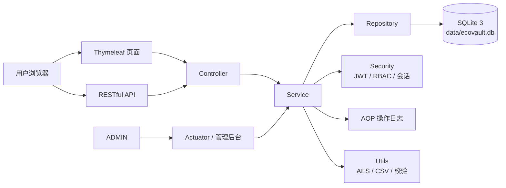
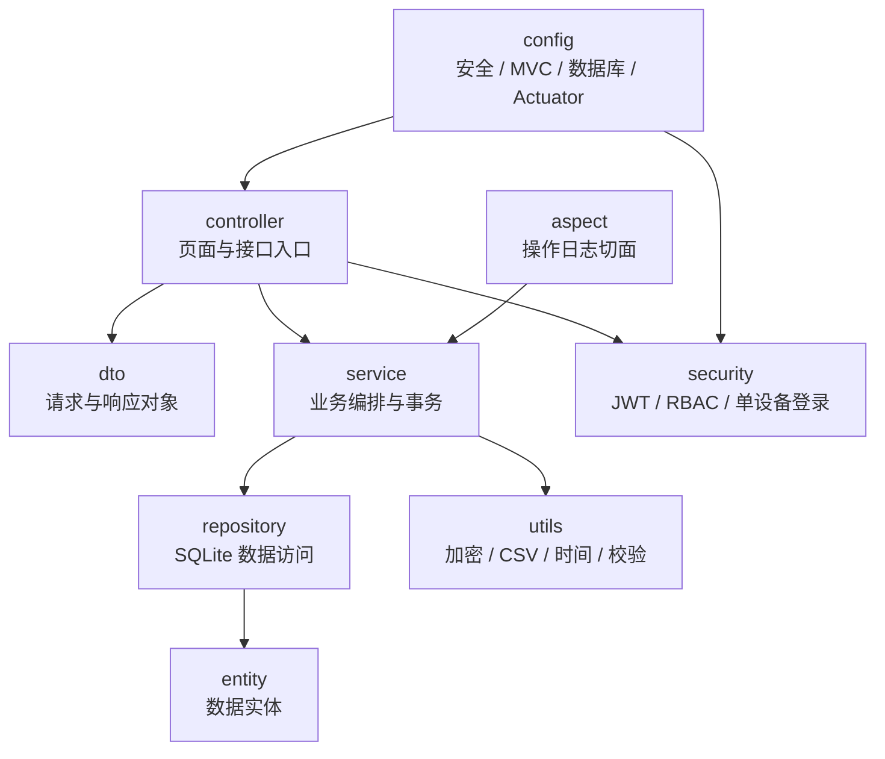
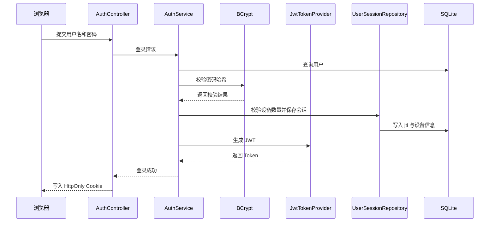
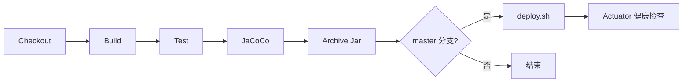

# EcoVault 设计文档

> 每次代码变更都需同步更新本文档。

## 1. 项目概述与目标

EcoVault（生态保险箱）是一个个人数据安全存储与管理平台，目标是为用户提供密码管理、工资财务管理、操作日志审计与管理后台能力。系统以安全、可审计、易维护、易部署为核心原则，支持个人私有化部署和小团队内部使用。

目标：

- 以加密和权限隔离保护个人敏感数据。
- 通过 RBAC 区分 `USER` 与 `ADMIN` 权限。
- 通过 AOP 自动记录关键操作，形成可追踪审计链路。
- 通过 Jenkins、GitHub Actions 与部署脚本降低运维成本。
- 通过测试覆盖率和开发规范保证长期可维护性。

## 2. 技术架构

### 整体架构

### 分层架构

统一包名前缀为 `com.tlcsdm.ecovault`。

## 3. 功能模块设计

### 用户管理

职责：管理员创建用户、登录、退出、当前用户信息、账号启用禁用、会话管理。

主要类：`AuthController`、`AdminController`、`AuthService`、`AdminService`、`JwtTokenProvider`、`UserSessionRepository`、`UserRepository`。

流程：

1. 管理员在后台用户管理页提交新用户信息。
2. 服务端校验用户名唯一性，并使用 BCrypt 处理初始密码。
3. 新用户默认授予 `USER` 角色并启用。
4. 用户登录后，系统查询用户、校验 BCrypt 哈希、判断启用状态和角色，根据 `ecovault.security.max-devices` 处理旧会话，生成 JWT 并写入会话记录。

### 密码管理

职责：密码条目增删改查、标签管理、强度检测、搜索、AES 加密存储。

主要类：`PasswordController`、`PasswordService`、`PasswordStrengthUtil`、`AesUtil`、`PasswordEntryRepository`。

流程：用户提交条目，后端校验权限与字段，敏感字段 AES-GCM 加密后保存，AOP 记录操作日志。

### 财务管理

职责：工资数据录入、统计分析、CSV 导出，预留消费数据扩展。

主要类：`SalaryController`、`SalaryService`、`SalaryRecordRepository`。

流程：用户录入工资记录，系统校验金额和日期，保存后按月份、年份汇总，并通过 Chart.js 展示。

### 日志管理

职责：AOP 自动记录操作日志，支持筛选、搜索、分页与导出。

主要类：`OperationLogAspect`、`OperationLogService`、`LogController`、`OperationLogRepository`。

流程：业务方法执行前后由切面收集用户、模块、动作、结果和 IP，脱敏后写入 `operation_logs`。

### 管理后台

职责：创建普通用户、启用禁用账号、系统状态、构建信息与 Actuator 信息查看。

主要类：`AdminController`、`AdminService`、`BuildProperties`。

## 4. 数据库设计

### 核心表

| 表 | 关键列 | 说明 | 索引 |
| --- | --- | --- | --- |
| users | id、username、password、role、enabled、created_at、updated_at | 用户基础信息与 BCrypt 哈希密码 | `idx_users_username` |
| user_sessions | id、user_id、jti、device_info、ip、active、created_at | 登录会话与单设备控制 | `idx_user_sessions_user_id`、`idx_user_sessions_jti` |
| password_entries | id、user_id、title、username、secret、note、tags、strength_score、strength_level、created_at、updated_at | 密码条目与敏感字段密文 | `idx_password_entries_user_id`、`idx_password_entries_title` |
| salary_records | id、user_id、year、month、amount、type、remark、created_at、updated_at | 工资记录与统计来源 | `idx_salary_records_user_month` |
| operation_logs | id、user_id、module、operation、success、detail、created_at | 脱敏后的审计日志 | `idx_operation_logs_user_id`、`idx_operation_logs_created_at` |

## 5. 安全设计

### JWT 认证流程

### 单设备登录机制

- 配置项为 `ecovault.security.max-devices`。
- 每次登录生成新的 JWT `jti` 并持久化到 `user_sessions`。
- 超过设备限制时将最早的有效会话置为失效。
- 每次请求同时校验 JWT 签名、过期时间和 `jti` 是否仍为有效会话。
- 修改密码、禁用账号或退出登录时立即失效会话。

### RBAC

- `USER`：仅访问自身密码、工资与日志数据。
- `ADMIN`：访问用户管理、系统状态、构建信息、Actuator 和全局日志。
- 管理接口必须显式校验 `ADMIN`。
- 对外不开放注册接口，用户创建能力只保留在管理员后台。

### BCrypt 与 AES-GCM 设计

#### 登录密码处理

1. 管理员在后台创建用户时提交初始密码。
2. 服务端立即使用 `BCryptPasswordEncoder` 生成不可逆哈希。
3. 数据库仅保存哈希值，不保存盐值外的任何明文副本。
4. 登录时使用 `matches` 做哈希校验，失败统一返回模糊错误信息。

#### 密码条目加密流程

1. 应用从 `ECOVAULT_CRYPTO_SECRET` 读取 AES 主密钥材料。
2. `AesUtil` 将主密钥规范化到 AES 所需长度后创建密钥对象。
3. 每次加密时随机生成新的 IV，并使用 `AES/GCM/NoPadding` 处理敏感字段。
4. 输出内容采用“IV + 密文 + GCM 认证标签”组合并编码保存。
5. 解密时先拆分随机 IV，再校验 GCM 标签，若密文被篡改则直接失败。
6. 明文仅在内存中短暂存在，用于响应组装，不写日志、不写导出缓存、不写数据库。

#### 高敏数据保护要求

- 系统可能存储银行卡密码、支付口令等高度敏感信息，因此必须使用具备完整性校验的对称加密方案。
- 文档、日志、异常与页面均不得泄露密钥、明文、Token 或可逆提示。
- 示例配置只能提供占位符，生产环境应通过环境变量或专用密钥管理方案注入密钥。

### CSRF / XSS / SQL 注入防护

- 页面写操作通过 `CookieCsrfTokenRepository` + `X-XSRF-TOKEN` 头进行 CSRF 防护。
- 页面输出统一 HTML 转义。
- 数据访问使用 JPA 参数绑定，禁止拼接 SQL。
- CSV 导出防止公式注入。

### 时间与时区规范

- `spring.jackson.time-zone` 统一为 `GMT+8`。
- JSON 日期时间格式统一为 `yyyy/MM/dd HH:mm:ss`。
- Spring MVC 参数绑定格式同步配置为 `date=yyyy/MM/dd`、`time=HH:mm:ss`、`date-time=yyyy/MM/dd HH:mm:ss`。
- 额外的 `DateTimeConfig` 同步约束 Jackson 与 MVC，避免 `LocalDateTime` 使用默认 ISO 格式。

## 6. API 设计

| 模块 | 方法 | 端点 | 说明 | 权限 |
| --- | --- | --- | --- | --- |
| 用户 | POST | `/api/auth/login` | 用户登录 | 匿名 |
| 用户 | POST | `/api/auth/logout` | 用户退出 | USER |
| 用户 | GET | `/api/auth/me` | 当前用户 | USER |
| 用户 | PUT | `/api/auth/profile` | 修改资料 | USER |
| 用户 | PUT | `/api/auth/password` | 修改密码 | USER |
| 密码 | GET | `/api/passwords` | 查询密码 | USER |
| 密码 | POST | `/api/passwords` | 新增密码 | USER |
| 密码 | PUT | `/api/passwords/{id}` | 更新密码 | USER |
| 密码 | DELETE | `/api/passwords/{id}` | 删除密码 | USER |
| 工资 | GET | `/api/finance/salaries` | 查询工资 | USER |
| 工资 | POST | `/api/finance/salaries` | 新增工资 | USER |
| 工资 | PUT | `/api/finance/salaries/{id}` | 更新工资 | USER |
| 工资 | DELETE | `/api/finance/salaries/{id}` | 删除工资 | USER |
| 工资 | GET | `/api/finance/salaries/statistics` | 工资统计 | USER |
| 工资 | GET | `/api/finance/salaries/export` | CSV 导出 | USER |
| 日志 | GET | `/api/logs` | 查询日志 | USER / ADMIN |
| 日志 | GET | `/api/logs/export` | 导出日志 | USER / ADMIN |
| 管理 | POST | `/api/admin/users` | 创建普通用户 | ADMIN |
| 管理 | GET | `/api/admin/users` | 用户列表 | ADMIN |
| 管理 | PUT | `/api/admin/users/{id}/status` | 启用禁用 | ADMIN |
| 管理 | GET | `/api/admin/build-info` | 构建信息 | ADMIN |

## 7. 前端设计

页面：`/`、`/login`、`/dashboard`、`/passwords`、`/finance`、`/logs`、`/profile`、`/admin`、`/error`。

设计要求：支持暗色/亮色主题切换，采用玻璃拟态卡片、渐变背景、圆角阴影与响应式布局。工资趋势、年度统计、收入构成与后台状态图表使用 Chart.js。

## 8. 测试策略

- 使用 JUnit 5 编写单元测试和集成测试。
- 使用 JaCoCo 生成覆盖率报告，位置为 `target/site/jacoco/index.html`。
- Security、Service、Controller 核心路径均需覆盖。
- JWT、单设备登录、RBAC、AES、CSV 导出、统计逻辑必须覆盖边界场景。
- 外部注册关闭后，需验证管理员创建用户与匿名访问受限行为。

## 9. 部署与运维

### GitHub Actions / Jenkins 流程

### deploy.sh

- 部署脚本负责检查 Jar、停止旧服务、备份旧版本、复制新 Jar、以 `prod` profile 启动并执行健康检查。
- 默认健康检查地址为 `http://127.0.0.1:8100/actuator/health`。
- `server.shutdown: graceful` 与 `spring.lifecycle.timeout-per-shutdown-phase` 配合保证优雅停机。

## 10. 日志方案

- 建议使用 logback 管理运行日志。
- 操作日志写入 `operation_logs`，与系统运行日志分离。
- 日志必须脱敏，禁止输出 JWT、密码、密钥、数据库内容等敏感信息。
- 错误日志建议包含请求 ID，便于链路追踪。
