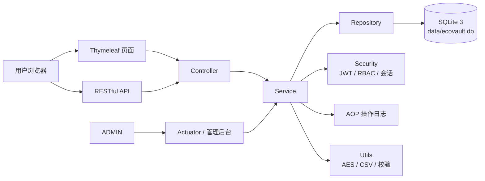
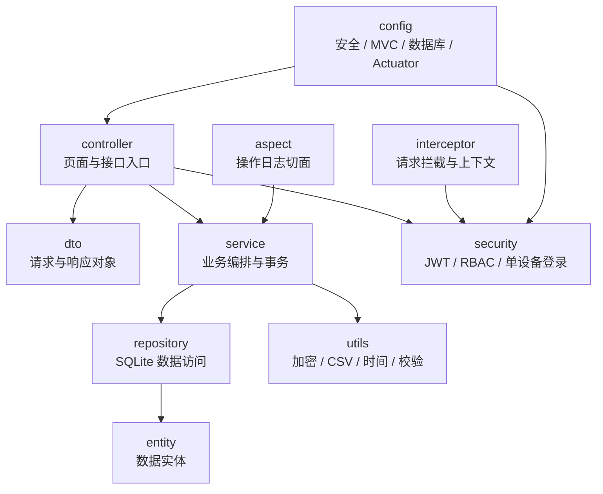
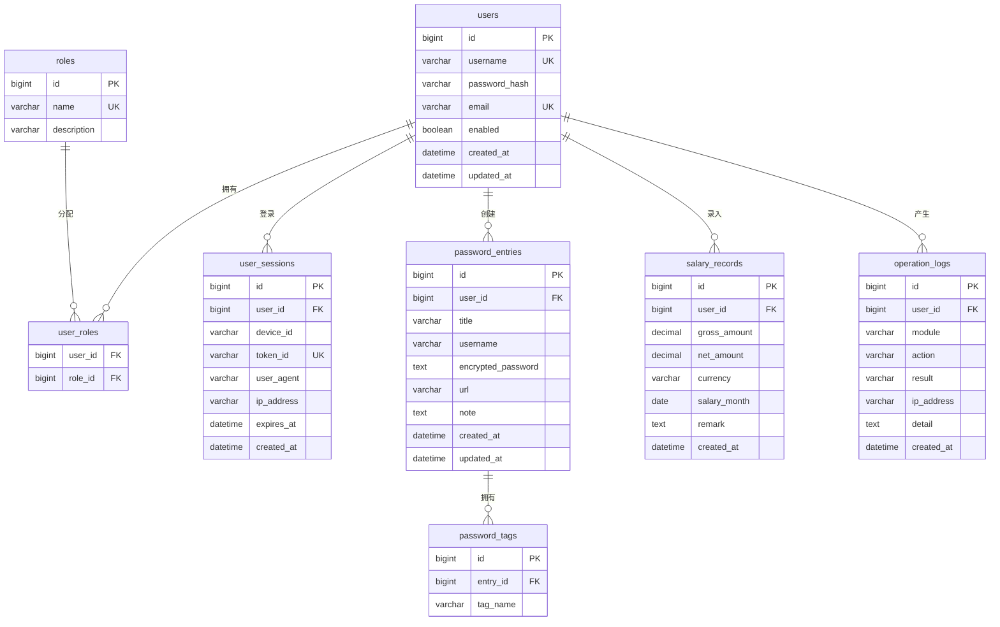
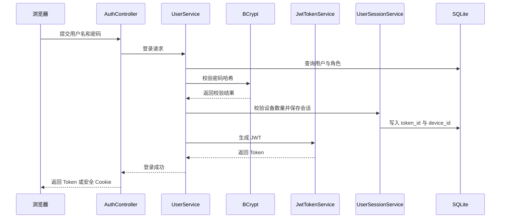
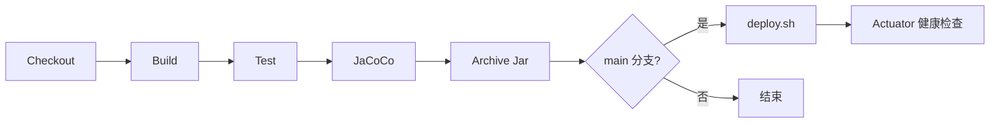

# EcoVault 设计文档

> 每次代码变更都需同步更新本文档。

## 1. 项目概述与目标

EcoVault（生态保险箱）是一个个人数据安全存储与管理平台，目标是为用户提供密码管理、工资财务管理、操作日志审计与管理后台能力。系统以安全、可审计、易维护、易部署为核心原则，支持个人私有化部署和小团队内部使用。

目标：

- 以加密和权限隔离保护个人敏感数据。
- 通过 RBAC 区分 `USER` 与 `ADMIN` 权限。
- 通过 AOP 自动记录关键操作，形成可追踪审计链路。
- 通过 Docker、Jenkins 与部署脚本降低运维成本。
- 通过测试覆盖率和开发规范保证长期可维护性。

## 2. 技术架构

### 整体架构

### 分层架构

统一包名前缀为 `com.tlcsdm.ecovault`。

## 3. 功能模块设计

### 用户管理

职责：注册、登录、退出、当前用户信息、角色管理、账号启用禁用、会话管理。

主要类：`AuthController`、`UserController`、`UserService`、`JwtTokenService`、`UserSessionService`、`UserRepository`、`RoleRepository`。

流程：提交账号密码后，系统查询用户、校验 BCrypt 哈希、判断启用状态和角色，根据 `ecovault.security.max-devices` 处理旧会话，生成 JWT 并写入会话记录。

### 密码管理

职责：密码条目增删改查、标签管理、强度检测、搜索、AES 加密存储。

主要类：`PasswordController`、`PasswordEntryService`、`PasswordTagService`、`PasswordStrengthService`、`CryptoService`、`PasswordEntryRepository`。

流程：用户提交条目，后端校验权限与字段，敏感字段 AES 加密后保存，AOP 记录操作日志。

### 财务管理

职责：工资数据录入、统计分析、CSV 导出，预留消费数据扩展。

主要类：`SalaryController`、`SalaryRecordService`、`FinanceStatisticsService`、`CsvExportService`、`SalaryRecordRepository`。

流程：用户录入工资记录，系统校验金额和日期，保存后按月份、年份汇总，并通过 Chart.js 或 ECharts 展示。

### 日志管理

职责：AOP 自动记录操作日志，支持筛选、搜索、分页与导出。

主要类：`OperationLogAspect`、`OperationLogService`、`OperationLogController`、`OperationLogRepository`。

流程：业务方法执行前后由切面收集用户、模块、动作、结果和 IP，脱敏后写入 `operation_logs`。

### 管理后台

职责：用户列表、启用禁用、角色管理、系统状态、构建信息与 Actuator 信息查看。

主要类：`AdminController`、`AdminUserService`、`BuildInfoService`、`SystemStatusService`。

## 4. 数据库设计

### ER 图

### 表结构与索引

| 表 | 关键列 | 约束 | 索引 |
| --- | --- | --- | --- |
| users | id、username、password_hash、email、enabled、created_at、updated_at | username 唯一，email 唯一 | `idx_users_username`、`idx_users_email` |
| roles | id、name、description | name 唯一 | `idx_roles_name` |
| user_roles | user_id、role_id | 联合主键，外键关联 users/roles | `idx_user_roles_user_id`、`idx_user_roles_role_id` |
| user_sessions | id、user_id、device_id、token_id、user_agent、ip_address、expires_at、created_at | token_id 唯一 | `idx_user_sessions_user_id`、`idx_user_sessions_token_id`、`idx_user_sessions_expires_at` |
| password_entries | id、user_id、title、username、encrypted_password、url、note、created_at、updated_at | user_id 外键 | `idx_password_entries_user_id`、`idx_password_entries_title` |
| password_tags | id、entry_id、tag_name | entry_id 外键 | `idx_password_tags_entry_id`、`idx_password_tags_tag_name` |
| salary_records | id、user_id、gross_amount、net_amount、currency、salary_month、remark、created_at | user_id 外键 | `idx_salary_records_user_month`、`idx_salary_records_salary_month` |
| operation_logs | id、user_id、module、action、result、ip_address、detail、created_at | user_id 外键 | `idx_operation_logs_user_id`、`idx_operation_logs_module`、`idx_operation_logs_created_at` |

## 5. 安全设计

### JWT 认证流程

### 单设备登录机制

- 配置项为 `ecovault.security.max-devices`。
- 每次登录生成 `device_id` 与 JWT `jti`。
- 超过设备限制时删除最旧会话或拒绝新会话，具体策略由配置决定。
- 每次请求校验 JWT 签名、过期时间和 `user_sessions.token_id` 有效性。
- 修改密码、禁用账号或退出登录时立即失效会话。

### RBAC

- `USER`：仅访问自身密码、工资与日志数据。
- `ADMIN`：访问用户管理、系统状态、构建信息、Actuator 和全局日志。
- 管理接口必须显式校验 `ADMIN`。

### BCrypt 与 AES

- 用户登录密码只保存 BCrypt 哈希。
- 密码条目敏感字段使用 AES 加密后入库。
- 密钥从安全配置或环境变量读取，禁止硬编码。

### CSRF / XSS / SQL 注入防护

- Thymeleaf 表单启用 CSRF Token。
- 页面输出统一 HTML 转义。
- 备注等用户输入进行安全清理。
- 数据访问使用参数绑定，禁止拼接 SQL。
- CSV 导出防止公式注入。

## 6. API 设计

| 模块 | 方法 | 端点 | 说明 | 权限 |
| --- | --- | --- | --- | --- |
| 用户 | POST | `/api/auth/register` | 用户注册 | 匿名 |
| 用户 | POST | `/api/auth/login` | 用户登录 | 匿名 |
| 用户 | POST | `/api/auth/logout` | 用户退出 | USER |
| 用户 | GET | `/api/auth/me` | 当前用户 | USER |
| 密码 | GET | `/api/passwords` | 查询密码 | USER |
| 密码 | POST | `/api/passwords` | 新增密码 | USER |
| 密码 | PUT | `/api/passwords/{id}` | 更新密码 | USER |
| 密码 | DELETE | `/api/passwords/{id}` | 删除密码 | USER |
| 工资 | GET | `/api/finance/salaries` | 查询工资 | USER |
| 工资 | POST | `/api/finance/salaries` | 新增工资 | USER |
| 工资 | PUT | `/api/finance/salaries/{id}` | 更新工资 | USER |
| 工资 | DELETE | `/api/finance/salaries/{id}` | 删除工资 | USER |
| 工资 | GET | `/api/finance/salaries/statistics` | 工资统计 | USER |
| 工资 | GET | `/api/finance/salaries/export` | CSV 导出 | USER |
| 日志 | GET | `/api/logs` | 查询日志 | USER / ADMIN |
| 日志 | GET | `/api/logs/export` | 导出日志 | USER / ADMIN |
| 管理 | GET | `/api/admin/users` | 用户列表 | ADMIN |
| 管理 | PATCH | `/api/admin/users/{id}/enabled` | 启用禁用 | ADMIN |
| 管理 | PUT | `/api/admin/users/{id}/roles` | 修改角色 | ADMIN |
| 管理 | GET | `/api/admin/system/status` | 系统状态 | ADMIN |
| 管理 | GET | `/api/admin/build-info` | 构建信息 | ADMIN |

## 7. 前端设计

页面：`/login`、`/register`、`/dashboard`、`/passwords`、`/finance/salaries`、`/logs`、`/admin/users`、`/admin/system`。

设计要求：支持暗色/亮色主题切换，采用玻璃拟态卡片、渐变背景、圆角阴影与响应式布局。工资趋势、年度统计、收入构成与后台状态图表使用 Chart.js 或 ECharts。

## 8. 测试策略

- 使用 JUnit 5 编写单元测试和集成测试。
- 使用 JaCoCo 生成覆盖率报告，位置为 `target/site/jacoco/index.html`。
- Service、Security、Repository、Controller 均需覆盖。
- JWT、单设备登录、RBAC、AES、CSV 导出、统计逻辑必须覆盖边界场景。
- 总体目标覆盖率不低于 80%，安全核心模块不低于 90%。

## 9. 部署与运维

### Jenkins 流程

### Docker 与 deploy.sh

Docker 使用 Maven Java 25 镜像构建，使用 Java 25 JRE 镜像运行，暴露 8080，并通过 `/actuator/health` 健康检查。`deploy.sh` 负责检查 Jar、停止旧服务、备份旧版本、复制新 Jar、以 `prod` profile 启动并执行健康检查。

## 10. 日志方案

- 建议使用 logback 管理运行日志。
- 控制台日志便于容器平台采集，文件日志便于传统服务器排查。
- 操作日志写入 `operation_logs`，与系统运行日志分离。
- 日志必须脱敏，禁止输出 JWT、密码、密钥、数据库内容等敏感信息。
- 错误日志建议包含请求 ID，便于链路追踪。
